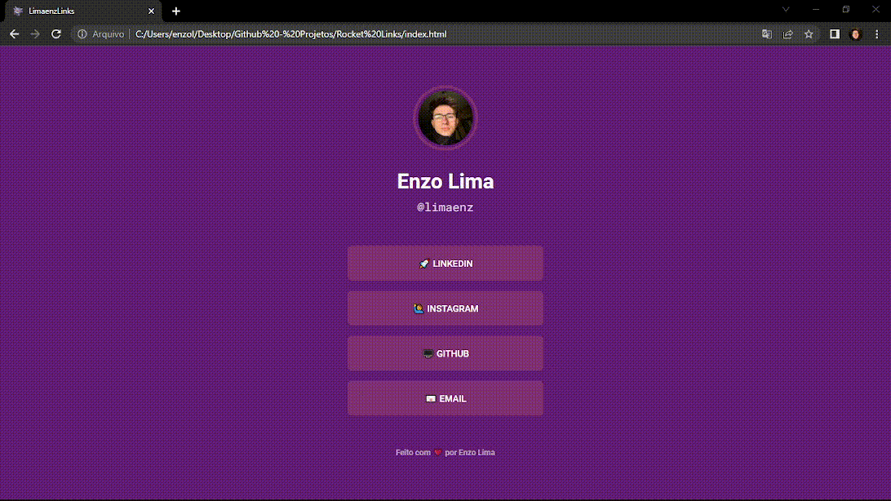

<h1 align="center">
  LimaenzLinks
</h1>

<h1>
    
</h1>

<h3 align="center">
    <a href="https://limaenz.github.io/limaenzlinks/">Acessar a demonstração</a>
</h3 >

---
# 📃 Indice 
  - [🔖 Sobre](#-sobre)
  - [🚀 Tecnologias utilizadas](#-tecnologias-utilizadas)
  - [📁 Como baixar o projeto](#-como-baixar-o-projeto)
---
## 🔖 Sobre

O projeto **LimaenzLinks** foi inspirado no famoso **Linktree** bastante utilizado na bio do instragram, este projeto foi desenvolvido dentro do programa **Maratona Explorer 2** da **Rocketseat** com o intuito de colocarmos em prática todo o conteúdo estudado em HTML e CSS.

---

## 🚀 Tecnologias utilizadas

o projeto foi desenvolvido utilizando as seguintes tecnologias

- [HTML](https://developer.mozilla.org/pt-BR/docs/Web/CSS)
- [CSS](https://www.w3schools.com/html/)
  
---

## 📁 Como baixar o projeto

```bash
#Clonar repositório
$ git clone https://github.com/limaenz/limaenzlinks

#Entrar no diretório
$ cd limaenzlinks

#Instalar as dependências 
$ yarn install

#Iniciar o projeto
$ yarn start
```


---

Desenvolvido 💻 por Enzo Lima